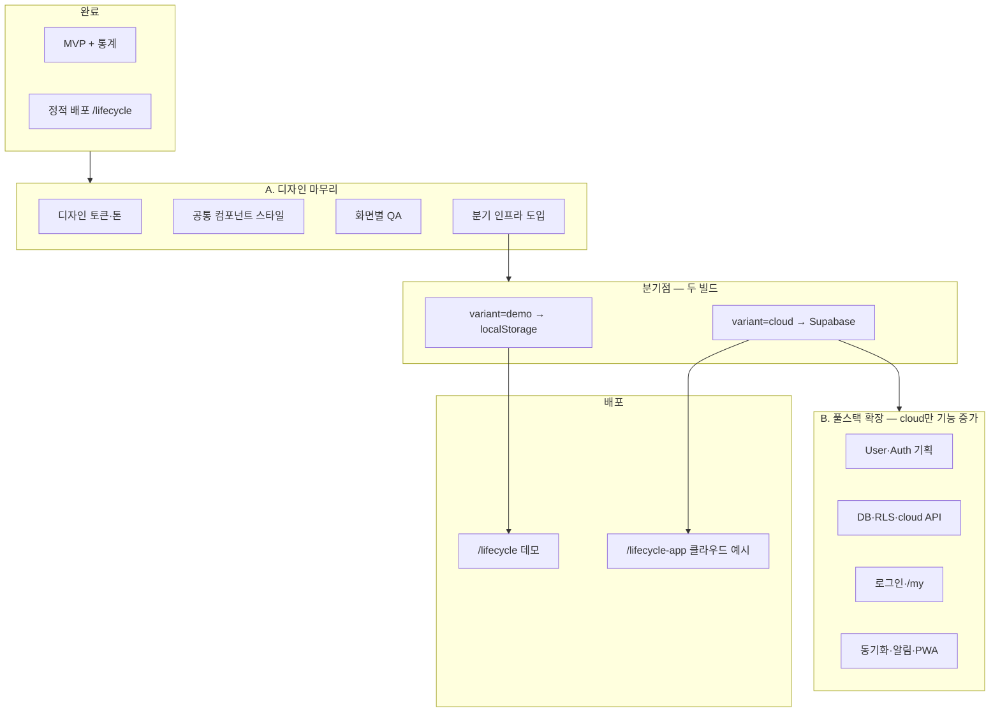

# LifeCycle — 디자인 마무리 · 이중 배포 · 풀스택 확장 로드맵

> **목적:** UI를 편안한 톤으로 정리한 뒤, **로컬 데모**와 **풀스택(클라우드)** 을 **같은 저장소·다른 빌드**로 나누어 배포한다.  
> **전제:** 클라우드 1차는 Supabase(브라우저 SDK) + 정적 export 유지 가능 → 현재 `limgeonhong.com` 서브경로 호스팅과 호환.

---

## 전체 흐름



| 단계 | 이름 | 산출 | 배포 대상 |
| :---: | :--- | :--- | :--- |
| — | MVP + 통계 | ✅ | `/lifecycle` (현재) |
| **A-1** | 디자인 마무리 | ✅ 편안한 UI·공통 Empty·모바일 QA | `/lifecycle` |
| **A-2** | **분기 인프라** (`demo`/`cloud` 빌드) | 예정 | 데모 + `/lifecycle-app` 슬롯 |
| **B** | 풀스택 확장 | Auth, DB, `/my` … | **cloud 빌드만** 기능 추가 (demo는 동결·버그픽스만) |

---

## A. 디자인 마무리 (풀스택 전)

### A-1. 방향 (편안한 분위기)

| 영역 | 현재(대략) | 목표 |
| :--- | :--- | :--- |
| 배경 | `#f8fafc` + 강한 `slate-900` 텍스트 | 따뜻한 중성(아이보리·웜 그레이), 대비는 유지하되 **선명함 완화** |
| 카드·모달 | 기본 border | **큰 radius**, 얕은 그림자, 여백 확대 |
| 신호등 | red/yellow/green | 채도 낮춘 톤 + 기존 **텍스트 라벨** 유지 (a11y) |
| 타이포 | 시스템 기본 | `line-height`·`letter-spacing` 여유, 제목/본문 위계 정리 |
| 네비·버튼 | 컴팩트 | 터치 영역·패딩 통일, primary는 **부드러운 단색** (과한 검정 X) |

**작업 범위 (코드)**

1. `tailwind.config.ts` — `colors`, `borderRadius`, `boxShadow`, `fontFamily` 토큰
2. `src/app/globals.css` — CSS 변수 (`--background`, `--surface`, `--muted`, 상태 색)
3. (선택) `src/components/ui/` — `Button`, `Card`, `Badge`, `ModalShell` 등 공통 래퍼로 중복 제거
4. 화면 패스: `/`, `/items`, `/stats`, 모달·Empty state

**완료 기준**

- [x] 디자인 토큰 (`globals.css` CSS 변수 + `tailwind.config.ts`)
- [x] 공통 UI (`Button`, `Input`, `Card`, `Chip`, `PageLoading`) + 컴포넌트 클래스 (`card`, `input-field` 등)
- [x] Noto Sans KR 폰트 · 웜 배경·세이지 primary · 신호등 채도 완화
- [x] 주요 화면·모달 스타일 적용
- [x] 통합 Empty state (`EmptyState`, 비용 전용 일러스트)
- [x] 모바일 실기기 QA (이슈 없음, 2025-05 기준)
- [ ] WCAG 대비 4.5:1 정식 점검 (필요 시 추후)
- [ ] README·예시 페이지 스크린샷 갱신 (선택)

**상태:** **A-1 완료** — 다음은 **A-2 분기 인프라** 후 B단계 풀스택.

---

### A-2. 분기 인프라 (디자인 마무리 **마지막**에 넣기)

디자인은 **공통**이므로 variant와 무관하게 한 번 적용한다.  
**분기점**은 “UI가 만족스러운 시점”에 커밋해, 이후 풀스택 작업이 demo 배포를 깨지 않게 한다.

#### 환경 변수 (빌드 시점)

| 변수 | `demo` | `cloud` |
| :--- | :--- | :--- |
| `NEXT_PUBLIC_APP_VARIANT` | `demo` | `cloud` |
| `DEPLOY_BASE_PATH` (기존) | `/lifecycle` | `/lifecycle-app` *(경로는 자유, 예시)* |
| Supabase URL/Key | 없음 | `.env.production` / `.env.local` |

로컬 개발:

| 명령 (추가 예정) | 동작 |
| :--- | :--- |
| `npm run dev` | `demo` — localStorage, `localhost:3000` |
| `npm run dev:cloud` | `cloud` — Supabase, 동일 포트 (env만 다름) |

배포 빌드:

| 명령 (추가 예정) | `out/` 업로드 위치 |
| :--- | :--- |
| `npm run build:demo` | 서버 `.../lifecycle/` |
| `npm run build:cloud` | 서버 `.../lifecycle-app/` |

#### 코드 구조 (목표)

```
src/lib/api/
  types.ts              # IDataService 인터페이스 (공통)
  localStorageService.ts  # 기존 apiService.ts 이동·이름 정리
  supabaseService.ts    # B단계에서 구현
  index.ts              # variant에 따라 구현체 export
```

- `DataContext`·컴포넌트는 **`@/lib/api`** 만 import (직접 `apiService` X).
- **런타임**이 아니라 **빌드 타임** 분기 → 번들에 불필요한 Supabase 코드가 demo에 안 들어감.

#### README / 예시 링크

| 버전 | 예시 URL (안) |
| :--- | :--- |
| 데모 (로컬 저장) | `https://limgeonhong.com/lifecycle/` |
| 클라우드 (풀스택) | `https://limgeonhong.com/lifecycle-app/` |

두 링크를 README 상단에 나란히 두고, 각각 `DEPLOY_BASE_PATH`·`build:demo` / `build:cloud` 안내.

**완료 기준 (분기 인프라)**

- [ ] `build:demo` / `build:cloud` 로 각각 `out/` 생성·서버 업로드 검증
- [ ] cloud 빌드는 Supabase 미설정 시 **명확한 안내 화면** (빈 화면 X)
- [ ] demo 빌드는 기존과 동일 동작 (회귀 없음)

---

## B. 풀스택 확장 (`cloud` variant만)

> demo variant는 **기능 동결**. UI 버그·a11y·카피만 공통 반영 가능.

### B-0. 사전 문서 (1~2일)

| 산출물 | 내용 |
| :--- | :--- |
| `LifeCycle_User_Auth_Plan.md` | User 모델, 로그인 방식(Supabase Auth 권장), `/my` IA, RLS 원칙 |
| `LifeCycle_Supabase_Schema.md` | categories / items / logs 테이블, `user_id` FK, 마이그레이션 |

### B-1. DB + API 계층 (3~5일)

- [ ] Supabase 프로젝트, 테이블·RLS (`auth.uid()` = row owner)
- [ ] `supabaseService.ts` — `IDataService`와 동일 시그니처
- [ ] 시드: demo는 기존 `seed.ts`, cloud는 **로그인 사용자별** 또는 온보딩 플로우
- [ ] (선택) demo → cloud **JSON 마이그레이션** 도구 (`/my` 또는 1회성 import)

### B-2. Auth + `/my` (3~5일)

- [ ] Supabase Auth (이메일 magic link 또는 OAuth 1종)
- [ ] `/my` — 프로필, 로그아웃, (선택) 데이터보내기
- [ ] 미로그인 시 cloud 빌드: 로그인 유도, 핵심 라우트 가드
- [ ] `userId: 1` 제거 → JWT `sub` 기준

### B-3. 동기화·알림 (5~7일, 선택)

- [ ] 멀티 디바이스: cloud만 (실시간은 Supabase Realtime 또는 폴링)
- [ ] `notificationEnabled` + 브라우저 Notification / (후순위) 푸시
- [ ] PWA manifest — **cloud 빌드**에만 manifest URL이 basePath 맞게

### B-4. 운영·학습 정리

- [ ] README: 두 variant 차이 표
- [ ] 포트폴리오: “Mock API → 인터페이스 → Supabase RLS” 서술
- [ ] (선택) GitHub Actions: `main` push 시 `build:demo` + `build:cloud` 아티팩트

---

## 이중 배포 — 가능 여부 요약

| 질문 | 답 |
| :--- | :--- |
| 같은 repo에서 두 URL로 배포 가능? | **가능** — `APP_VARIANT` + `DEPLOY_BASE_PATH` 조합으로 **빌드 2번**, `out/`을 경로별 업로드 |
| 로컬 dev와 풀스택 dev 동시에? | **가능** — `dev` / `dev:cloud` 스크립트 + env 파일 분리 |
| 둘 다 정적 호스팅? | **가능(1차)** — Supabase를 브라우저에서만 쓰면 `output: 'export'` 유지 |
| Next.js API Route가 필요하면? | cloud만 Vercel/Node로 **배포 방식 2종** (데모=정적, 클라우드=SSR) — 2차 분기, 1차는 불필요할 가능성 큼 |

---

## 권장 작업 순서 (체크리스트)

### A-1 디자인 마무리 — ✅ 완료

1. [x] 디자인 토큰 + globals + Tailwind
2. [x] 공통 UI + 화면·모달·Empty
3. [x] 모바일 QA

### 다음 → A-2 분기 인프라

4. [ ] `IDataService` + `api/index.ts` + `build:demo` / `build:cloud` / `dev:cloud`
5. [ ] 서버에 `/lifecycle-app` 디렉터리·cloud 빌드 슬롯
6. [ ] README 두 예시 링크 반영

### 그다음 → 풀스택 (cloud만)

7. [ ] B-0 User·Auth + Schema 문서
8. [ ] B-1 Supabase + `supabaseService`
9. [ ] B-2 Auth + `/my`
10. [ ] B-3 알림·PWA (선택)

---

## `next.config.ts` 확장 예시 (A-2에서 적용)

```ts
const DEPLOY_BASE_PATH =
  process.env.DEPLOY_BASE_PATH ??
  (process.env.NEXT_PUBLIC_APP_VARIANT === "cloud"
    ? "/lifecycle-app"
    : "/lifecycle");
```

빌드 스크립트 예시 (`package.json`):

```json
{
  "dev:cloud": "NEXT_PUBLIC_APP_VARIANT=cloud next dev",
  "build:demo": "NEXT_PUBLIC_APP_VARIANT=demo DEPLOY_BASE_PATH=/lifecycle next build",
  "build:cloud": "NEXT_PUBLIC_APP_VARIANT=cloud DEPLOY_BASE_PATH=/lifecycle-app next build"
}
```

---

## 리스크·주의

| 항목 | 대응 |
| :--- | :--- |
| demo/cloud UI 드리프트 | 스타일은 **variant 무관** 공통; 기능만 `if (variant === 'cloud')` 최소화 |
| cloud 빌드에 Supabase 키 노출 | **anon key + RLS**만 클라이언트; service role 금지 |
| 두 `out/` 덮어쓰기 | CI에서 `out-demo` / `out-cloud`로 rename 후 업로드 |
| 풀스택 중 demo 깨짐 | `build:demo`를 PR마다 또는 릴리스 전 1회 실행 |

---

## 관련 문서

| 문서 | 역할 |
| :--- | :--- |
| [LifeCycle_Project_Plan.md](./LifeCycle_Project_Plan.md) | 서비스·3단계 로드맵 |
| [LifeCycle_Development_Plan.md](./LifeCycle_Development_Plan.md) | 기술·API 계층 |
| [README.md](../README.md) | 실행·배포·예시 URL |

*작성: 풀스택 확장 전 디자인·이중 배포 계획 정리*
